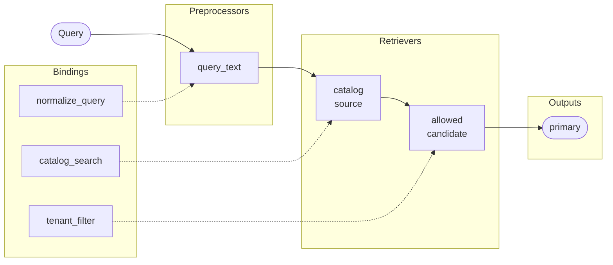
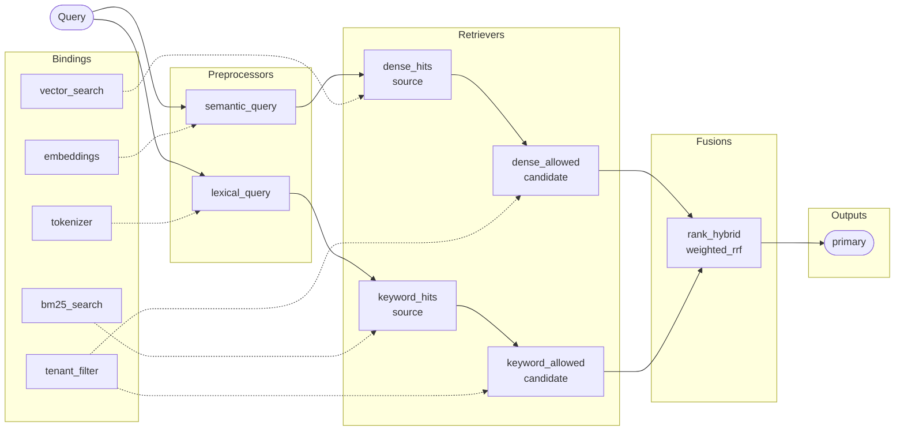
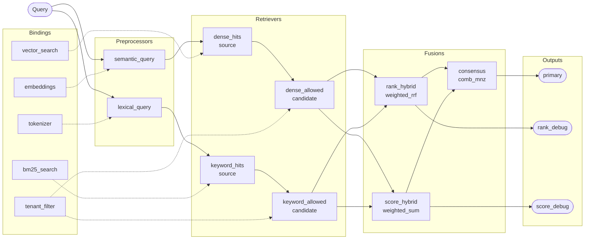
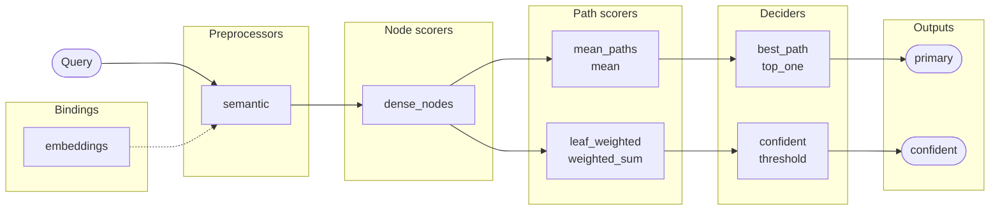
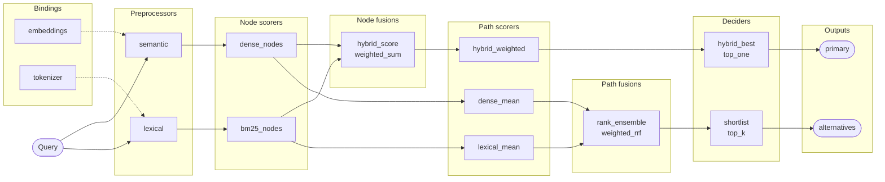
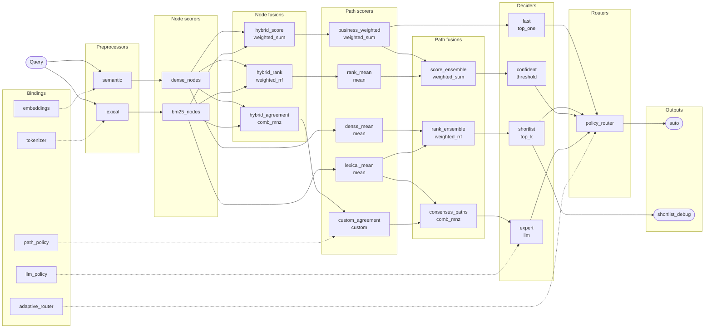

# Ejemplos progresivos

Esta guía comienza donde termina el [README](README.md). Cada configuración es
completa y ejecutable por sí sola; el siguiente nivel agrega una capacidad sin
cambiar el contrato de los niveles anteriores.

| Producto | Nivel 1 | Nivel 2 | Nivel 3 |
|---|---|---|---|
| Retrieval | Cascada restringida | Búsqueda híbrida | Ensamble completo |
| Tree Classification | Más estrategias de path | Dense + BM25 | Routing completo |

Los nodos sólidos pertenecen al YAML. Las conexiones punteadas muestran qué
objeto de `ComponentBindings` implementa cada etapa. Los clientes externos
(`search_client`, `vector_store`, `embedding_model`, etc.) representan las
integraciones de tu aplicación.

# RetrievalPipeline

## Nivel 1: agrega una etapa restringida

Partimos del retrieval mínimo del README y agregamos un filtro de tenant. Como
declara `input: catalog`, `allowed` solo puede filtrar o reordenar los chunks
que recibió de `catalog`.



`retrieval-cascade.yaml`:

```yaml
version: 1
name: catalog_cascade
kind: retrieve

preprocessors:
  - name: query_text
    binding: normalize_query

retrievers:
  - name: catalog
    binding: catalog_search
    preprocessor: query_text
    top_k: 100
  - name: allowed
    binding: tenant_filter
    preprocessor: query_text
    input: catalog
    top_k: 20

outputs:
  primary: allowed
```

Bindings — reutiliza `NormalizeQuery` y `CatalogSearch` del README y suma el
filtro:

```python
from chunkbuster import ComponentBindings, Ranking


class TenantFilter:
    def __init__(self, tenant):
        self.tenant = tenant

    def retrieve_candidates(self, query, candidates, *, top_k):
        allowed = (
            item
            for item in candidates
            if item.item.metadata.get("tenant") == self.tenant
        )
        return Ranking(tuple(allowed)[:top_k])


bindings = ComponentBindings(
    preprocessors={"normalize_query": NormalizeQuery()},
    retrievers={
        "catalog_search": CatalogSearch(search_client),
        "tenant_filter": TenantFilter(tenant="acme"),
    },
)
```

## Nivel 2: agrega una segunda señal y fusión por rank

Ahora la query se representa de dos formas. La rama dense consulta un
vectorstore; la rama lexical consulta un índice BM25. Ambas se filtran y
`weighted_rrf` combina sus posiciones sin comparar escalas de score.



`retrieval-hybrid.yaml`:

```yaml
version: 1
name: hybrid_catalog
kind: retrieve

preprocessors:
  - name: semantic_query
    binding: embeddings
  - name: lexical_query
    binding: tokenizer

retrievers:
  - name: dense_hits
    binding: vector_search
    preprocessor: semantic_query
    top_k: 100
  - name: keyword_hits
    binding: bm25_search
    preprocessor: lexical_query
    top_k: 100
  - name: dense_allowed
    binding: tenant_filter
    preprocessor: semantic_query
    input: dense_hits
    top_k: 50
  - name: keyword_allowed
    binding: tenant_filter
    preprocessor: lexical_query
    input: keyword_hits
    top_k: 50

fusions:
  - name: rank_hybrid
    type: weighted_rrf
    inputs: [dense_allowed, keyword_allowed]
    weights: [0.7, 0.3]
    k: 60
    top_k: 20

outputs:
  primary: rank_hybrid
```

Bindings — conserva `TenantFilter` y agrega los adapters dense y lexical:

```python
from chunkbuster import ComponentBindings, RankedItem, Ranking, TextTokenizer
from chunkbuster.retrieval import Chunk


def as_ranking(hits):
    return Ranking(
        tuple(
            RankedItem(
                hit.id,
                Chunk(hit.id, hit.text, hit.metadata),
                hit.score,
            )
            for hit in hits
        )
    )


class EmbeddingQuery:
    def __init__(self, model):
        self.model = model

    async def prepare_query(self, text):
        return await self.model.embed(text)


class VectorSearch:
    def __init__(self, store):
        self.store = store

    async def retrieve(self, vector, *, top_k):
        return as_ranking(await self.store.search(vector, limit=top_k))


class BM25Search:
    def __init__(self, index):
        self.index = index

    async def retrieve(self, tokens, *, top_k):
        return as_ranking(await self.index.search(tokens, limit=top_k))


bindings = ComponentBindings(
    preprocessors={
        "embeddings": EmbeddingQuery(embedding_model),
        "tokenizer": TextTokenizer(strip_accents=True),
    },
    retrievers={
        "vector_search": VectorSearch(vector_store),
        "bm25_search": BM25Search(bm25_index),
        "tenant_filter": TenantFilter(tenant="acme"),
    },
)
```

## Nivel 3: ensamble completo y múltiples outputs

El último nivel conserva las dos ramas anteriores y calcula tres resultados:
uno basado en ranks, otro en scores normalizados y un consenso que premia la
coincidencia entre ambos. Las fusiones pueden consumir otras fusiones.



`retrieval-ensemble.yaml`:

```yaml
version: 1
name: catalog_ensemble
kind: retrieve

preprocessors:
  - name: semantic_query
    binding: embeddings
  - name: lexical_query
    binding: tokenizer

retrievers:
  - name: dense_hits
    binding: vector_search
    preprocessor: semantic_query
    top_k: 100
  - name: keyword_hits
    binding: bm25_search
    preprocessor: lexical_query
    top_k: 100
  - name: dense_allowed
    binding: tenant_filter
    preprocessor: semantic_query
    input: dense_hits
    top_k: 50
  - name: keyword_allowed
    binding: tenant_filter
    preprocessor: lexical_query
    input: keyword_hits
    top_k: 50

fusions:
  - name: rank_hybrid
    type: weighted_rrf
    inputs: [dense_allowed, keyword_allowed]
    weights: [0.7, 0.3]
    k: 60
    top_k: 30
  - name: score_hybrid
    type: weighted_sum
    inputs: [dense_allowed, keyword_allowed]
    weights: [0.7, 0.3]
    normalization: min_max
    top_k: 30
  - name: consensus
    type: comb_mnz
    inputs: [rank_hybrid, score_hybrid]
    weights: [1.0, 1.0]
    normalization: min_max
    top_k: 20

outputs:
  primary: consensus
  rank_debug: rank_hybrid
  score_debug: score_hybrid
```

Bindings — son los mismos adapters del nivel 2; solo cambia el grafo:

```python
bindings = ComponentBindings(
    preprocessors={
        "embeddings": EmbeddingQuery(embedding_model),
        "tokenizer": TextTokenizer(strip_accents=True),
    },
    retrievers={
        "vector_search": VectorSearch(vector_store),
        "bm25_search": BM25Search(bm25_index),
        "tenant_filter": TenantFilter(tenant="acme"),
    },
)

pipeline = await RetrievalPipeline.build(
    config="retrieval-ensemble.yaml",
    bindings=bindings,
)
result = await pipeline.retrieve(
    "facturas de septiembre",
    outputs=("primary",),
)
```

# TreeClassificationPipeline

Los tres niveles usan la taxonomía `support` del README. El preprocessor
semántico también es el mismo: genera embeddings de nodos durante `build()` si
la taxonomía todavía no los contiene.

## Nivel 1: agrega estrategias de path y outputs

Partimos del scorer dense y calculamos dos rankings de paths. Uno usa la media;
el otro da más peso a la hoja. Cada ranking alimenta un decider y se publica
como output independiente.



`tree-path-strategies.yaml`:

```yaml
version: 1
name: support_path_strategies
kind: tree_classification

preprocessors:
  - name: semantic
    type: embedding
    binding: embeddings
    dimensions: 3

node_scorers:
  - name: dense_nodes
    type: dense
    preprocessor: semantic
    similarity: cosine

path_scorers:
  - name: mean_paths
    type: mean
    input: dense_nodes
    top_k: 10
  - name: leaf_weighted
    type: weighted_sum
    input: dense_nodes
    terms:
      - root: 0.10
      - mean: 0.30
      - leaf: 0.60
    top_k: 10

deciders:
  - name: best_path
    type: top_one
    input: mean_paths
  - name: confident
    type: threshold
    input: leaf_weighted
    min_score: 0.65
    count: 3

outputs:
  primary: best_path
  confident: confident
```

Bindings — no aparece ninguna integración nueva respecto del README:

```python
bindings = ComponentBindings(
    preprocessors={"embeddings": Embeddings(embedding_model)},
)

pipeline = await TreeClassificationPipeline.build(
    taxonomy=taxonomy,
    config="tree-path-strategies.yaml",
    bindings=bindings,
)
```

## Nivel 2: agrega BM25 y fusiones híbridas

La rama lexical suma BM25. `hybrid_score` fusiona scores de nodos para un path
ponderado; `rank_ensemble` combina los rankings dense y lexical sin exigir que
sus escalas sean comparables.



`tree-hybrid.yaml`:

```yaml
version: 1
name: support_hybrid
kind: tree_classification

preprocessors:
  - name: semantic
    type: embedding
    binding: embeddings
    dimensions: 3
  - name: lexical
    type: tokenizer
    binding: tokenizer

node_scorers:
  - name: dense_nodes
    type: dense
    preprocessor: semantic
    similarity: cosine
  - name: bm25_nodes
    type: bm25
    preprocessor: lexical
    k1: 1.2
    b: 0.75

node_fusions:
  - name: hybrid_score
    type: weighted_sum
    inputs: [dense_nodes, bm25_nodes]
    weights: [0.65, 0.35]
    normalization: min_max

path_scorers:
  - name: dense_mean
    type: mean
    input: dense_nodes
    top_k: 20
  - name: lexical_mean
    type: mean
    input: bm25_nodes
    top_k: 20
  - name: hybrid_weighted
    type: weighted_sum
    input: hybrid_score
    terms:
      - root: 0.10
      - mean: 0.25
      - leaf: 0.65
    top_k: 20

path_fusions:
  - name: rank_ensemble
    type: weighted_rrf
    inputs: [dense_mean, lexical_mean]
    weights: [0.65, 0.35]
    k: 60
    top_k: 20

deciders:
  - name: hybrid_best
    type: top_one
    input: hybrid_weighted
  - name: shortlist
    type: top_k
    input: rank_ensemble
    count: 3

outputs:
  primary: hybrid_best
  alternatives: shortlist
```

Bindings — se conserva el modelo semántico y se agrega el tokenizer incluido:

```python
from chunkbuster import ComponentBindings, TextTokenizer

bindings = ComponentBindings(
    preprocessors={
        "embeddings": Embeddings(embedding_model),
        "tokenizer": TextTokenizer(
            mode="word",
            case_sensitive=False,
            strip_accents=True,
            min_length=2,
        ),
    },
)

pipeline = await TreeClassificationPipeline.build(
    taxonomy=taxonomy,
    config="tree-hybrid.yaml",
    bindings=bindings,
)
```

## Nivel 3: grafo completo con routing

El último nivel muestra todos los tipos disponibles de node fusion, path
scorer, path fusion y decider. Cada decider recibe su propio ranking; el router
los inspecciona y elige cuál ejecutar.



`tree-complete.yaml`:

```yaml
version: 1
name: support_complete
kind: tree_classification

preprocessors:
  - name: semantic
    type: embedding
    binding: embeddings
    dimensions: 3
  - name: lexical
    type: tokenizer
    binding: tokenizer

node_scorers:
  - name: dense_nodes
    type: dense
    preprocessor: semantic
    similarity: cosine
  - name: bm25_nodes
    type: bm25
    preprocessor: lexical
    k1: 1.2
    b: 0.75

node_fusions:
  - name: hybrid_score
    type: weighted_sum
    inputs: [dense_nodes, bm25_nodes]
    weights: [0.65, 0.35]
    normalization: min_max
  - name: hybrid_rank
    type: weighted_rrf
    inputs: [dense_nodes, bm25_nodes]
    weights: [0.65, 0.35]
    k: 60
  - name: hybrid_agreement
    type: comb_mnz
    inputs: [dense_nodes, bm25_nodes]
    weights: [1.0, 1.0]
    normalization: min_max

path_scorers:
  - name: dense_mean
    type: mean
    input: dense_nodes
    top_k: 20
  - name: lexical_mean
    type: mean
    input: bm25_nodes
    top_k: 20
  - name: business_weighted
    type: weighted_sum
    input: hybrid_score
    terms:
      - root: 0.10
      - mean: 0.25
      - leaf: 0.65
    top_k: 20
  - name: rank_mean
    type: mean
    input: hybrid_rank
    top_k: 20
  - name: custom_agreement
    type: custom
    input: hybrid_agreement
    binding: path_policy
    top_k: 20

path_fusions:
  - name: rank_ensemble
    type: weighted_rrf
    inputs: [dense_mean, lexical_mean]
    weights: [0.65, 0.35]
    k: 60
    top_k: 20
  - name: score_ensemble
    type: weighted_sum
    inputs: [business_weighted, rank_mean]
    weights: [0.8, 0.2]
    normalization: z_score
    top_k: 20
  - name: consensus_paths
    type: comb_mnz
    inputs: [lexical_mean, custom_agreement]
    weights: [0.4, 0.6]
    normalization: min_max
    top_k: 20

deciders:
  - name: fast
    type: top_one
    input: business_weighted
  - name: shortlist
    type: top_k
    input: rank_ensemble
    count: 3
  - name: confident
    type: threshold
    input: score_ensemble
    min_score: 0.20
    count: 3
  - name: expert
    type: llm
    input: consensus_paths
    binding: llm_policy
    count: 1

routers:
  - name: policy_router
    deciders: [fast, shortlist, confident, expert]
    binding: adaptive_router
    parameters:
      fast_threshold: 0.85
      confidence_threshold: 0.40

outputs:
  auto: policy_router
  shortlist_debug: shortlist
```

Bindings — suma una política de path, un adapter LLM y el router:

```python
from chunkbuster import ComponentBindings, DecisionSelection, TextTokenizer


class BusinessPathPolicy:
    def score_path(self, path, node_scores):
        return 0.7 * node_scores[-1] + 0.3 * min(node_scores)


class LLMPolicy:
    def __init__(self, client):
        self.client = client

    async def decide(self, query, candidates, *, count):
        answer = await self.client.choose(
            query=query.text,
            candidates=candidates.to_text(),
            limit=count,
        )
        return DecisionSelection(
            path_ids=tuple(answer.path_ids),
            reason=answer.reason,
            metadata={"model": answer.model},
        )


class AdaptiveRouter:
    def route(self, query, candidates, *, parameters):
        fast = candidates["fast"]
        if fast and fast[0].score >= parameters["fast_threshold"]:
            return "fast"
        confident = candidates["confident"]
        if confident and confident[0].score >= parameters["confidence_threshold"]:
            return "confident"
        if len(candidates["shortlist"]) >= 3:
            return "shortlist"
        return "expert"


bindings = ComponentBindings(
    preprocessors={
        "embeddings": Embeddings(embedding_model),
        "tokenizer": TextTokenizer(strip_accents=True),
    },
    path_scorers={"path_policy": BusinessPathPolicy()},
    deciders={"llm_policy": LLMPolicy(llm_client)},
    routers={"adaptive_router": AdaptiveRouter()},
)

pipeline = await TreeClassificationPipeline.build(
    taxonomy=taxonomy,
    config="tree-complete.yaml",
    bindings=bindings,
)
result = await pipeline.classify("Me cobraron dos veces")
```

## Qué demuestra la progresión

- `input` convierte un retriever en una etapa restringida; no hace falta un
  tipo especial para una cascada.
- `weighted_rrf` fusiona posiciones; `weighted_sum` y `comb_mnz` fusionan
  scores con `none`, `min_max` o `z_score`.
- Un path scorer consume exactamente un node scorer o node fusion.
- Una path fusion combina rankings de path scorers.
- Los deciders pueden consumir rankings distintos y un router selecciona cuál
  ejecutar.
- Todo nodo declarado debe alcanzar un output directa o indirectamente.

Vuelve al [README](README.md) para el quick start o consulta
[ARCHITECTURE.md](ARCHITECTURE.md) para los contratos internos.
