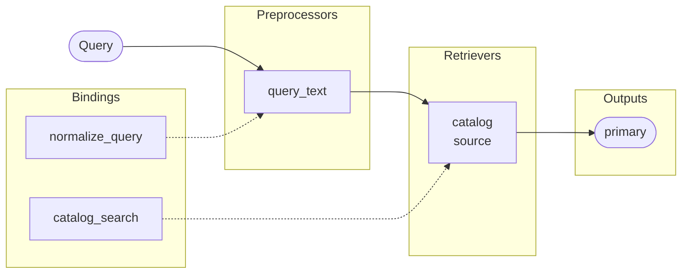
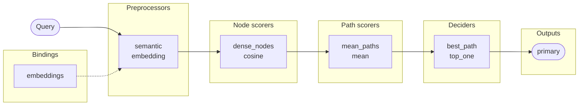

# Chunkbuster

**Diseña retrieval y clasificación jerárquica como grafos declarativos.**

Tu estrategia de ranking debería cambiar en YAML, no quedar repartida por todo
el código. Chunkbuster separa la topología del pipeline de las tecnologías que
la ejecutan: conecta tus modelos, índices y reglas como bindings Python;
combínalos y publica varios resultados sin acoplarte a un proveedor.

> Estado: `0.4.0`, API experimental. Requiere Python 3.12 o superior.

| Producto | Para qué sirve | Qué combina |
|---|---|---|
| `RetrievalPipeline` | Recuperar, filtrar y ordenar chunks | Fuentes, etapas restringidas y fusiones |
| `TreeClassificationPipeline` | Elegir paths de una taxonomía | Dense/BM25, scoring de paths, fusiones, reglas y LLMs |

## Por qué Chunkbuster

- **Híbrido de verdad:** dense y sparse pueden convivir antes y después de
  construir rankings.
- **Configurable sin magia:** YAML describe el grafo; Python implementa solo
  las integraciones externas.
- **Seguro al construir:** referencias rotas, ciclos, nombres duplicados y
  ramas sin salida fallan antes de procesar tráfico.
- **Proveedor agnóstico:** trae tu vectorstore, buscador, modelo de embeddings o
  LLM. Chunkbuster no gestiona SDKs, credenciales ni secretos.
- **Contratos pequeños:** bindings síncronos y asíncronos; resultados tipados e
  inmutables.

## Instalación

```bash
uv sync --dev
uv run pytest
```

O con `pip`:

```bash
python -m venv .venv
source .venv/bin/activate
python -m pip install -e .
pytest
```

## El modelo mental

La configuración responde **qué se conecta**. Los bindings responden **cómo se
ejecuta**.

```python
pipeline = await SomePipeline.build(
    config="pipeline.yaml",
    bindings=ComponentBindings(...),
)
```

El valor de cada `binding` en YAML busca una clave dentro de
`ComponentBindings`. Así puedes sustituir Pinecone por pgvector, Elasticsearch
por OpenSearch o un LLM por una regla local sin rediseñar el grafo.

¿Quieres pasar de estos ejemplos mínimos a cascadas, búsqueda híbrida, fusión
de rankings y routing? Consulta la guía progresiva de [ejemplos
avanzados](EXAMPLES.md).

## Retrieval mínimo

Una query, una fuente y un output: el pipeline más corto útil.



`retrieval-simple.yaml`:

```yaml
version: 1
name: catalog_search
kind: retrieve

preprocessors:
  - name: query_text
    binding: normalize_query

retrievers:
  - name: catalog
    binding: catalog_search
    preprocessor: query_text
    top_k: 10

outputs:
  primary: catalog
```

Bindings y ejecución:

```python
from chunkbuster import ComponentBindings, RankedItem, Ranking
from chunkbuster.retrieval import Chunk, RetrievalPipeline


class NormalizeQuery:
    def prepare_query(self, text):
        return text.casefold().strip()


class CatalogSearch:
    def __init__(self, client):
        self.client = client

    async def retrieve(self, query, *, top_k):
        hits = await self.client.search(query, limit=top_k)
        return Ranking(
            tuple(
                RankedItem(
                    hit.id,
                    Chunk(hit.id, hit.text, hit.metadata),
                    hit.score,
                )
                for hit in hits
            )
        )


bindings = ComponentBindings(
    preprocessors={"normalize_query": NormalizeQuery()},
    retrievers={"catalog_search": CatalogSearch(search_client)},
)

pipeline = await RetrievalPipeline.build(
    config="retrieval-simple.yaml",
    bindings=bindings,
)
result = await pipeline.retrieve("Auriculares inalámbricos")
print(result.outputs["primary"].ranking.ids)
```

## Clasificación semántica mínima

Una taxonomía es un bosque. Cada hoja define una clase mediante su path desde
la raíz. En este ejemplo, `build()` genera una vez los embeddings ausentes de
los nodos; cada query se compara semánticamente contra ellos.



`tree-simple.yaml`:

```yaml
version: 1
name: support_semantic
kind: tree_classification

preprocessors:
  - name: semantic
    type: embedding
    binding: embeddings
    dimensions: 3

node_scorers:
  - name: dense_nodes
    type: dense
    preprocessor: semantic
    similarity: cosine

path_scorers:
  - name: mean_paths
    type: mean
    input: dense_nodes
    top_k: 10

deciders:
  - name: best_path
    type: top_one
    input: mean_paths

outputs:
  primary: best_path
```

Taxonomía, binding y ejecución:

```python
from chunkbuster import (
    ComponentBindings,
    Taxonomy,
    TaxonomyEdge,
    TaxonomyNode,
    TreeClassificationPipeline,
)


class Embeddings:
    def __init__(self, model):
        self.model = model

    async def prepare_documents(self, texts):
        return await self.model.embed_many(texts, dimensions=3)

    async def prepare_query(self, text):
        return await self.model.embed(text, dimensions=3)


taxonomy = Taxonomy(
    id="support",
    nodes=(
        TaxonomyNode("support", "Soporte"),
        TaxonomyNode("billing", "Facturación"),
        TaxonomyNode("refunds", "Reembolsos"),
        TaxonomyNode("access", "Acceso"),
    ),
    edges=(
        TaxonomyEdge("support", "billing"),
        TaxonomyEdge("billing", "refunds"),
        TaxonomyEdge("support", "access"),
    ),
)

bindings = ComponentBindings(
    preprocessors={"embeddings": Embeddings(embedding_model)},
)

pipeline = await TreeClassificationPipeline.build(
    taxonomy=taxonomy,
    config="tree-simple.yaml",
    bindings=bindings,
)
result = await pipeline.classify("Necesito un reembolso")
print(result.outputs["primary"].selected[0].item.node_ids)
```

Si los nodos ya contienen embeddings, `prepare_documents()` no se ejecuta. La
cobertura debe ser completa: todos presentes o todos generados durante
`build()`.

## Capacidades incluidas

### Fusiones compartidas

| Método | Cuándo usarlo | Normalización |
|---|---|---|
| `weighted_rrf` | Los scores no son comparables o solo confías en el orden | No aplica |
| `weighted_sum` | Los scores representan señales calibrables | `none`, `min_max`, `z_score` |
| `comb_mnz` | Quieres premiar candidatos respaldados por varias señales | `none`, `min_max`, `z_score` |

Retrieval conserva `rrf` como alias compatible de `weighted_rrf`.

### Tree Classification

| Etapa | Opciones incluidas |
|---|---|
| Node scorer | `dense` (`cosine`, `dot_product`, `euclidean`), `bm25` |
| Node fusion | `weighted_rrf`, `weighted_sum`, `comb_mnz` |
| Path scorer | `mean`, `weighted_sum`, `custom` |
| Path fusion | `weighted_rrf`, `weighted_sum`, `comb_mnz` |
| Decider | `top_one`, `top_k`, `threshold`, `llm` |
| Terminal | decider directo o router entre deciders |

## Contratos de bindings

| Binding | Método requerido | Devuelve |
|---|---|---|
| Preprocessor de query | `prepare_query(text)` | Representación aceptada por el consumidor |
| Preprocessor de documentos | `prepare_documents(texts)` | Una representación por texto |
| Retriever fuente | `retrieve(query, *, top_k)` | `Ranking[Chunk]` |
| Retriever restringido | `retrieve_candidates(query, candidates, *, top_k)` | Subconjunto de `Ranking[Chunk]` |
| Path scorer custom | `score_path(path, node_scores)` | `float` finito |
| Decider LLM | `decide(query, candidates, *, count)` | `DecisionSelection` |
| Router | `route(query, candidates, *, parameters)` | Nombre de decider o `DecisionRoute` |

Todos pueden ser síncronos o asíncronos. La configuración acepta un `Mapping`,
una ruta `.yaml`/`.yml`, una ruta `.json` o un modelo Pydantic ya validado. Las
claves desconocidas fallan.

## Siguiente paso

- Sigue la evolución completa en [EXAMPLES.md](EXAMPLES.md): cascadas,
  retrieval híbrido, BM25, node/path fusion, deciders y routers.
- Consulta [ARCHITECTURE.md](ARCHITECTURE.md) para contratos internos,
  invariantes y límites del runtime.

## Alcance actual

Chunkbuster orquesta ranking; no reemplaza tu stack. Todavía no incluye
integraciones oficiales con proveedores, persistencia, índices incrementales,
servidor HTTP, CLI, ejecución concurrente ni aislamiento de fallos por output.

La API es experimental y puede cambiar.
